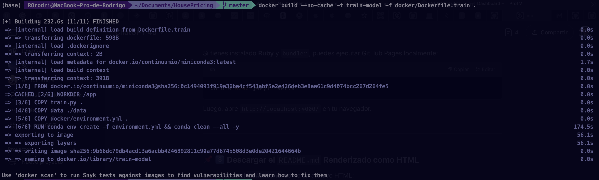
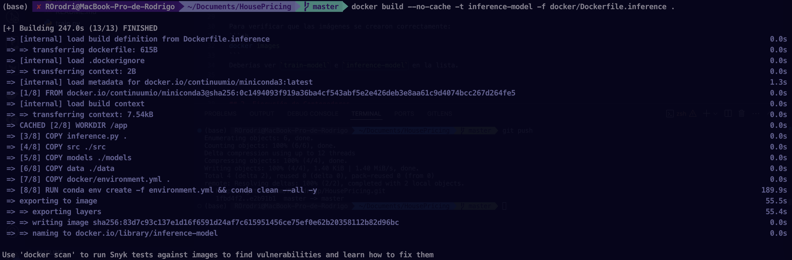
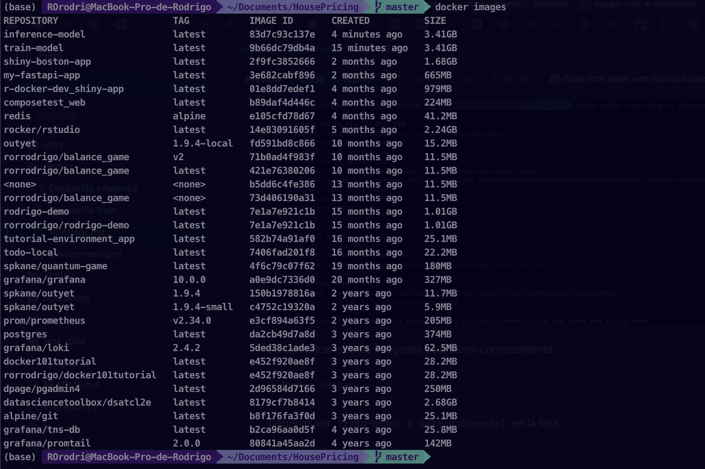
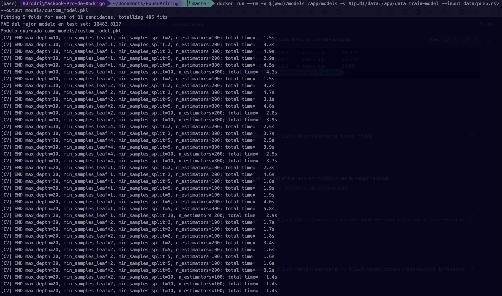
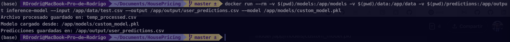
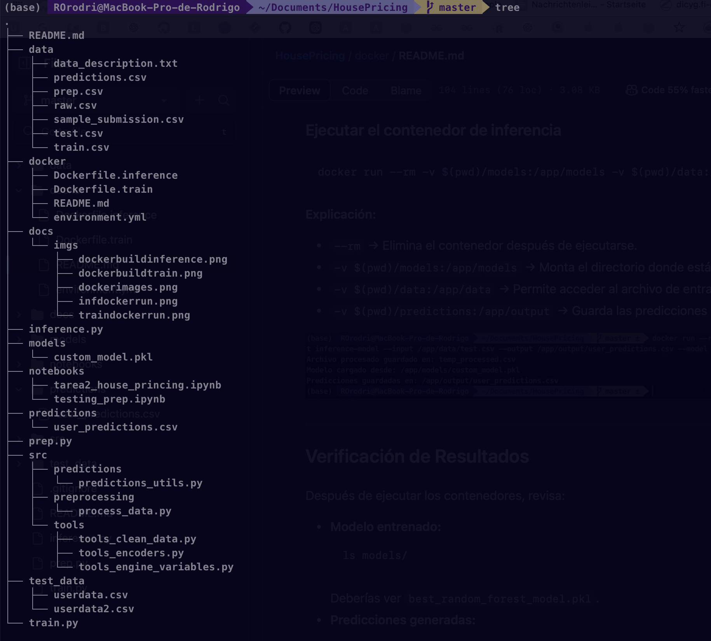

# House Pricing - Contenedores Docker

Este proyecto contiene dos contenedores Docker:
1. **Entrenamiento**: Ejecuta `train.py` para entrenar un modelo de Random Forest.
2. **Inferencia**: Ejecuta `inference.py` para generar predicciones con el modelo entrenado.

## Requisitos
Asegúrate de tener instalado:
- [Docker](https://docs.docker.com/get-docker/)
- Un sistema operativo compatible (Linux/Mac/Windows con WSL2)

---

## 1. Construcción de Imágenes Docker

### Construir la imagen para entrenamiento
Ejecuta desde el directorio raíz del proyecto:
```sh
docker build -t train-model -f docker/Dockerfile.train .
```



### Construir la imagen para inferencia
Ejecuta desde el directorio raíz del proyecto:
```sh
docker build -t inference-model -f docker/Dockerfile.inference .
```




Para verificar que las imágenes se crearon correctamente:
```sh
docker images
```
Deberías ver `train-model` e `inference-model` en la lista.


---

## 2. Ejecución de Contenedores

### Ejecutar el contenedor de entrenamiento
```sh
docker run --rm -v $(pwd)/models:/app/models -v $(pwd)/data:/app/data train-model
```

**Explicación:**
- `--rm` → Elimina el contenedor después de ejecutarse.
- `-v $(pwd)/models:/app/models` → Guarda el modelo entrenado en `models/` en la máquina local.
- `-v $(pwd)/data:/app/data` → Permite que `train.py` acceda a `data/prep.csv`.

Si deseas usar un archivo de entrada diferente:
```sh
docker run --rm -v $(pwd)/models:/app/models -v $(pwd)/data:/app/data train-model --input data/prep.csv --output models/custom_model.pkl
```




---

### Ejecutar el contenedor de inferencia
```sh
docker run --rm -v $(pwd)/models:/app/models -v $(pwd)/data:/app/data -v $(pwd)/predictions:/app/output inference-model --input /app/data/test.csv --output /app/output/user_predictions.csv --model /app/models/custom_model.pkl
```

**Explicación:**
- `--rm` → Elimina el contenedor después de ejecutarse.
- `-v $(pwd)/models:/app/models` → Monta el directorio donde está el modelo entrenado.
- `-v $(pwd)/data:/app/data` → Permite acceder al archivo de entrada (`test.csv`).
- `-v $(pwd)/predictions:/app/output` → Guarda las predicciones en `predictions/` en la máquina local.



---

## 3. Descripción de los Dockerfiles y Uso de Conda

El proyecto usa dos `Dockerfile` ubicados en `docker/`:

### **Dockerfile para entrenamiento (`Dockerfile.train`)**

```dockerfile
FROM continuumio/miniconda3

WORKDIR /app

COPY ../train.py .
COPY ../src ./src
COPY ../data ./data
COPY ../docker/environment.yml .

RUN conda env create -f environment.yml && conda clean --all -y

ENV PATH /opt/conda/envs/arquitectura/bin:$PATH

ENTRYPOINT ["python", "train.py"]
CMD ["--input", "data/prep.csv", "--output", "models/best_random_forest_model.pkl"]
```

### **Dockerfile para inferencia (`Dockerfile.inference`)**

```dockerfile
FROM continuumio/miniconda3

WORKDIR /app

COPY ../inference.py .
COPY ../src ./src
COPY ../models ./models
COPY ../data ./data
COPY ../docker/environment.yml .

RUN conda env create -f environment.yml && conda clean --all -y

ENV PATH /opt/conda/envs/arquitectura/bin:$PATH

ENTRYPOINT ["python", "inference.py"]
CMD ["--input", "data/test.csv", "--output", "data/predictions.csv"]
```

### **Uso de Conda en los Contenedores**
Ambos `Dockerfile` utilizan `Miniconda` para gestionar dependencias de Python. Se usa:
- `FROM continuumio/miniconda3` para partir de una imagen base con Conda.
- `RUN conda env create -f environment.yml && conda clean --all -y` para crear un entorno con los paquetes requeridos.
- `ENV PATH /opt/conda/envs/arquitectura/bin:$PATH` para que el entorno Conda `arquitectura` sea el predeterminado dentro del contenedor.

Esto asegura que todas las dependencias sean instaladas correctamente y el entorno sea consistente entre el contenedor de entrenamiento e inferencia.

---

## 4. Verificación de Resultados
Después de ejecutar los contenedores, revisa:
- **Modelo entrenado:**
  ```sh
  ls models/
  ```
  Deberías ver `best_random_forest_model.pkl`.
- **Predicciones generadas:**
  ```sh
  ls predictions/
  ```
  Deberías ver `predictions.csv` o el archivo de salida especificado.



---

## 5. Solución de Problemas
Si hay errores en la ejecución de un contenedor, puedes ingresar en modo interactivo:
```sh
docker run --rm -it train-model bash
```
Dentro del contenedor, ejecuta manualmente los comandos para verificar archivos y configuraciones.

---

Ahora puedes entrenar y hacer inferencias usando Docker de manera eficiente.

